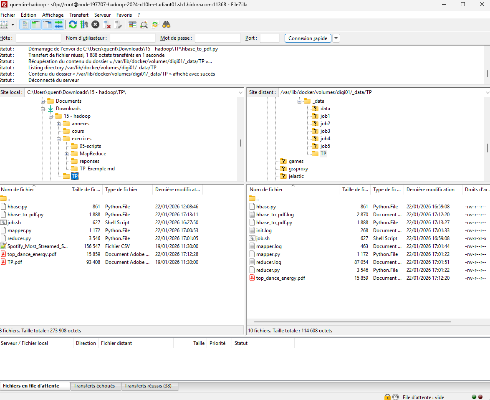

# **Analyse des tendances musicales avec Hadoop**

<br>

## **<u>Sommaire</u>**

- [**Analyse des tendances musicales avec Hadoop**](#analyse-des-tendances-musicales-avec-hadoop)
  - [**Sommaire**](#sommaire)
  - [**Introduction**](#introduction)
  - [**Présentation des données**](#présentation-des-données)
  - [**Connexion à la machine virtuelle**](#connexion-à-la-machine-virtuelle)
  - [**Lancement des services Hadoop**](#lancement-des-services-hadoop)
  - [**Import des données dans HDFS**](#import-des-données-dans-hdfs)
  - [**Initialisation et création de la table HBase**](#initialisation-et-création-de-la-table-hbase)
    - [**Fonctionnement**](#fonctionnement)
  - [**Traitement MapReduce**](#traitement-mapreduce)
    - [**Mapper**\*](#mapper)
    - [**Reducer**\*](#reducer)
  - [**Stockage des résultats**](#stockage-des-résultats)
    - [**HDFS**](#hdfs)
    - [**HBase**](#hbase)
  - [**Visualisation des résultats**](#visualisation-des-résultats)
  - [**Analyse des tendances observées**](#analyse-des-tendances-observées)

<div style="ppage-break-after: always;"></div>

## **Introduction**

---

Avec l'essor des plateformes de streaming musical, les volumes de données générés par les écoutes sont devenus massifs. Ces données contiennent de nombreuses **caractéristiques musicales** (danceability, énergie, etc.) permettant d'analyser les **facteurs de popularité** des chansons.

Ce TP s'inscrit dans un contexte de **Big Data**, en exploitant l'écosystème **Hadoop** afin de :
- traiter efficacement de grands volumes de données via **MapReduce**,
- persister les résultats dans **HBase**,
- visualiser le résultat grâce à **Python et Matplotlib**

<div style="page-break-after: always;"></div>

## **Présentation des données**

---

Le jeu de données utilisé est un fichier CSV contenant les chansons les plus streamées sur Spotify.

Champs exploités :
- `streams` : nombre total d'écoutes,
- `danceability_%` : proporsion d'un titre à être dansant,
- `ènergy_%` : intensité et dynamisme du morceau.

Les autres colonnes ne sont pas utilisées dans ce traitement.

<div style="page-break-after: always;"></div>

## **Connexion à la machine virtuelle**

---

La connexion à la machine virtuelle avec le logiciel **PuTTY** via le protocole **SSH**.


Paramètres utilisés :
- **Adresse IP** : fournie par l'infrastructure
- **Port SSH** : spécifique à l'environnement
- **Utilisateur / mot de passe** : fournis pour le TP

Une fois connecté, l'ensemble des traitements est réalisé depuis le conteneur Hadoop.

On commence d'ailleurs par exécuté le shell : ./start_docker_digi.sh, qui effectue les commandes suivantes :

```bash

```

<div style="page-break-after: always;"></div>

## **Lancement des services Hadoop**

---

Les services nécessaires au TP sont :
- **HDFS** : stockage distribué,
- **YARN** : gestion des ressources,
- **ZooKeeper** : coordination,
- **HBase** : base NoSQL distribuée.
- **Thrift** : API HappyBase / Python

On exécute le shell : ./lance_srv_slaves.sh, qui effectue les commandes suivantes :

```bash

```

Ainsi que le shell : ./service_hbase_thrift.sh, qui effectue les commandes suivantes :

```base

```

Ces services doivent être actifs avant toute exécution MapReduce.

<div style="page-break-after: always;"></div>

## **Import des données dans HDFS**

---

Les données sont importées dans HDFS afin d'être accessible au job MapReduce.

Pour ce faire on utilise **FileZila** avec exactement la même configuration que **PuTTY**



On ajoute le CSV dans ce chemin de fichier : **/var/lib/docker/volumes/digi01/_data/TP/data**, puis sur PuTTY on exécute la commande :

```bash
hdfs dfs -put /datavolume1/TP/Spotify_Most_Streamed_Songs.csv /user/input
```

Le fichier devient alors accessible depuis tous les noeuds du cluster.

<div style="page-break-after: always;"></div>

## **Initialisation et création de la table HBase**

---

Avant de traiter le MapReduce, on va créer une **Hbase** grâce à un script **Python**

Le script `hbase.py` a pour but de **préparer l’environnement HBase** pour le TP :

- Supprime la table `streams_by_dance_energy` si elle existe,
- Crée une nouvelle table avec une famille de colonnes `data`,
- Assure que les logs permettent de suivre l’exécution.

---

### **Fonctionnement**

1. **Connexion à HBase** via HappyBase (Thrift Server sur le port 9090).  
2. **Suppression de la table existante** si nécessaire (`delete_table`).  
3. **Création de la table** avec la famille de colonnes `data`.  
4. **Journalisation** de l’état et fermeture de la connexion.

## **Traitement MapReduce**

---

Le traitement est réalisé via **Hadoop Streaming** en utilisant des scripts Python.

Dans un premier temps, il faut donc envoyer le script **mapper.py** via **FileZila** à l'emplacement suivant: **/var/lib/docker/volumes/digi01/_data/TP**

### **Mapper***
Le Mapper:
- lit le fichier CSV depuis l'entrée standard,
- ignore l'en-tête,
- extrait `danceability`, `energy` et `stream`,
- émet les données sous forme :
```nginx
danceability  energy  streams
```
Des contrôles sont réalisées sur :
- le nombre de colonnes,
- les conversions de type.

Ensuite, il faut donc envoyer le script **reducer.py** via **FileZila** à l'emplacement suivant: **/var/lib/docker/volumes/digi01/_data/TP**

### **Reducer***
Le Reducer :
- reçoit les données triées par Hadoop,
- crée une **clé composite** `danceability_energy`,
- calcul :
  - la somme des streams,
  - le nombre d'occurrences,
  - la moyenne des streams,
- écrit les résultats :
  - dans **HDFS** (sortie MapReduce),
  - dans **HBase**.

<div style="page-break-after: always;"></div>

## **Stockage des résultats**

---


### **HDFS**
les résulats MapReduce sont stockés dans :
```bash
output/job_dance_energy
```
Chaque ligne contient :
```nginx
dance_energy  total_streams count average_streams
```


### **HBase**
Les résultats sont stockés dans la table :
```nginx
streams_by_dance_energy
```
- **RowKey** : `danceability_energy`
- **Famille de colonne** : `data`
  - `total_streams`
  - `count`
  - `average_streams`


<div style="page-break-after: always;"></div>

## **Visualisation des résultats**

---

Un script Python dédié récupère les données depuis **HBase** à l'aide de **HappyBase**.

Étapes :
- Lecture complète de la table HBase,
- Tri par moyenne de streams décroissante,
- Sélection des 10 meilleures combinaisons,
- Génération d'un graphique **Matplotlib**,
- Export au format **PDF**.


Le graphique permet d'identifier visuellement les combinaisons les plus performantes

<div style="page-break-after: always;"></div>

## **Analyse des tendances observées**

---

Les résultas montrent que :
- les chansons avec une **danceability élevée** combiné à une **énergie modérée à forte** obtiennent en moyenne plus de streams,
- les extrêmes (très faible énergie ou très faible danceability) sont moins performants,
- une combinaison équilibrée semble favoriser la popularité.
Cela confirme que les titres les plus écoutés sont souvent **dynamiques**, **rythmés** et **adaptés à un large public**.

<div style="page-break-after: always;"></div>