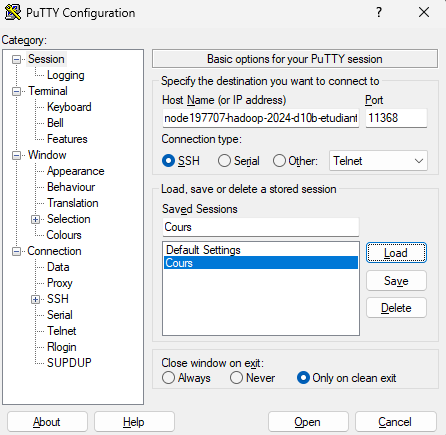

# **Analse des tendances musicales avec Hadoop**

<br>

## **<u>Sommaire</u>**

- [**Analse des tendances musicales avec Hadoop**](#analse-des-tendances-musicales-avec-hadoop)
  - [**Sommaire**](#sommaire)
  - [**Introduction**](#introduction)
  - [**Présentation des données**](#présentation-des-données)
  - [**Connexion à la machine virtuelle**](#connexion-à-la-machine-virtuelle)
  - [**Lancement des services Hadoop**](#lancement-des-services-hadoop)

<div style="ppage-break-after: always;"></div>

## **Introduction**

---

Avec l'essor des plateformes de streaming musical, les volumes de données générés par les écoutes sont devenus massifs. Ces données contiennent de nombreuses **caractéristiques musicales** (danceability, énergie, ect.) permettant d'analyser les **facteurs de popularité** des chansons.

Ce TP s'inscrit dans un contexte de **Big Data**, en exploitant l'écosystème **Hadoop** afin de :
- traiter efficacement de grands volumes de données via **MapReduce**,
- persister les résultats dans **HBase**,
- visualiser le résultat grâce à **Python et Matplotlib**

<div style="page-break-after: always;"></div>

## **Présentation des données**

---

Le jeu de données utilisé est un fichier CSV contenant les chansons les plus streamées sur Spotify.

Champs exploités :
- `streams` : nombre total d'écoutes,
- `danceability_%` : proporsion d'un titre à être dansant,
- `ènergy_%` : intensité et dynamisme du morceau.

Les autres colonnes ne sont pas utilisées dans ce traitement.

<div style="page-break-after: always;"></div>

## **Connexion à la machine virtuelle**

---

La connexion à la machine virtuelle avec le logiciel **PuTTY** via le protocole **SSH**.



Paramètres utilisés :
- **Adresse IP** : fournie par l'infrastructure
- **Port SSH** : spécifique à l'environnement
- **Utilisateur / mot de passe** : fournis pour le TP

Une fois connecté, l'ensemble des traitements est réalisé depuis le conteneur Hadoop.

On commence d'ailleurs par lancer le shell : ./start_docker_digi.sh, qui éffectue les commandes suivantes :

```bash

```

<div style="page-break-after: always;"></div>

## **Lancement des services Hadoop**

---

Les services nécessaires au TP sont:
- **HDFS** : stockage distribué,
- **YARN** : gestion des ressources,
- **ZooKeeper** : coordination,
- **HBase** : base NoSQL distribuée.
